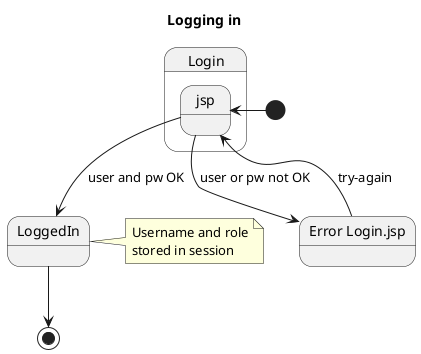
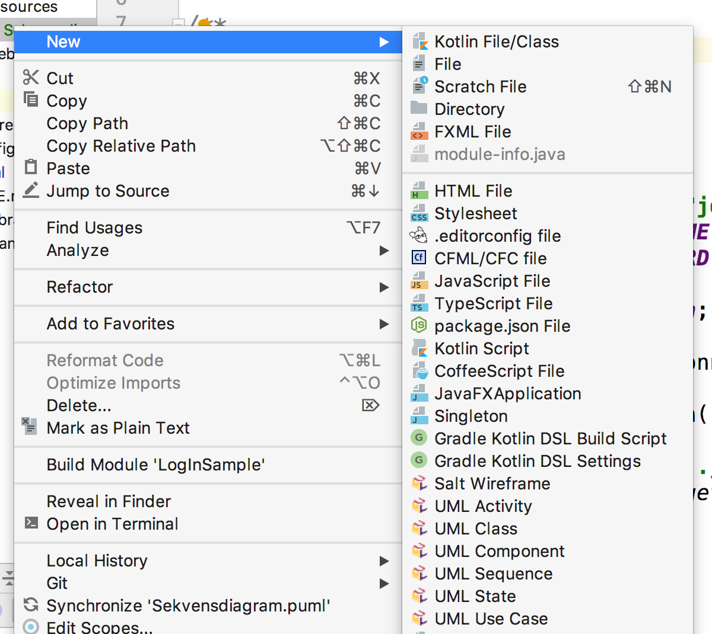

# Diagrammer på 2. semester
Der er mange værktøjer til at tegne diagrammer. Denne note vil kort beskrive et af disse - et som egner sig godt til brug på git og github.

Dog er det sådan, at der i MySQLWorkbench er et udemærket værktøj til at tegne ER diagrammer, så det vil jeg anbefale at man bruger.

## PlantUML

Git kan godt lide tekstfiler, og plantuml er en tekst syntaks til at beskrive UML diagrammer. Det har et automatiseret layout som gør at man ikke skal bruge tid på layout af diagrammer (og bare må acceptere når der laves dårlig layout).

PlantUML kan bruges til at lave:

* Domæne modeller (klasse diagrammer)
* Aktivitetsdiagrammer 
* Sekvens diagrammer
* Tilstandsdiagrammer (state charts) (vi bruger dem til at beskrive navigation med)

Der er to resourcer der nyttige til disse værktøj:

* [PlantUMLs hjemmeside](http://plantuml.com). Denne er noget rodet, men der er eksempler på alle UML diagrammer og hvordan man laver dem.
* [Planttext](https://www.planttext.com) som er en simpel side hvor man kan skrive sine diagrammer i browseren så man kan se hvordan diagrammet kommer til at se ud.

## Tilstandsdiagrammer (state charts) / navigations diagrammer
Vi skal kunne vise diagrammer der viser hvordan man kommer fra den ene side til den næste. Et eksempel kunne være dette:


Dette diagram viser at brugeren starter på Login.jsp siden. Den fyldte sorte klat er der hvor man starter. Den knap så fyldte klat på diagrammet under "LoggedIn" betyder at diagrammet er slut her.

Så måden dette diagram skal læses er at brugeren starter på Login.jsp. Der kan man indtaste brugernavn og password (det står ikke i diagrammet - diagrammer skal ikke vise det hele). Hvis brugernavn og password ikke passer skal man prøve igen, ellers "kommer man videre i systemet".

Diagrammet er lavet i [planttekst](https://www.planttext.com) med denne tekst



Der er mange andre muligheder i forbindelse med Statecharts. De fleste vil man ikke have brug for til at lave navigationsdiagrammer. Mulighederne er vist på [plantuml siden for state charts](http://plantuml.com/state-diagram).

## Sekvensdiagrammer (sequence diagrams)
Ideen i et sekvensdiagram er, at man kan følge hvordan et bruger-input forplanter sig ned igennem systemet. Et eksempel kan være, at vi prøver at lave et sekvensdiagram for login. Det kan se sådan ud:


Til højre har vi en bruger der skriver bruger navn og password ind på JSP siden Login. Disse sendes så i en http post til LoginServlet der spørger UserTableManager som igen spørger databasen om brugernavn og password passer sammen.

Databasen returnerer et resultset, som så checkes. Vi antager det gik godt, hvilket returneres til servlet som forwarder til CustomerHomePage der vises til brugeren.

Den tekst der tegner diagrammet er dette:

```
@startuml

title "Login - Sequence Diagram"

actor User
boundary Login.jsp
boundary CustHomePage.jsp
participant LoginServlet
participant UserTableManager
database ShopDatabase

User -> Login.jsp : username & password
Login.jsp -> LoginServlet: http POST login
LoginServlet -> UserTableManager: validate()
UserTableManager -> ShopDatabase: executeQuery()
ShopDatabase -> UserTableManager: resultset
UserTableManager -> UserTableManager: validate resultset
UserTableManager -> LoginServlet: OK
LoginServlet -> CustHomePage.jsp: forward
CustHomePage.jsp -> User: Welcome

@enduml
```

# PlantUML i IntelliJ
Hvis man virkelig vil kaste sig over at bruge PlantUML så kan man bruge et plugin i IntelliJ. Det skal ses som alternativ til at bruge [planttext](https://www.planttext.com). Fordelen er, at du kan inkludere dine diagrammer direkte i projektet, og dermed få koden på GitHub.

1. Søg på "PlantUML integration" i IntelliJs "Preferences -> Plugins" og installer.
2. Genstart IntelliJ

Nu bør du så være istand til at arbejde med plant UML is IntelliJ direkte ved at højreklikke på en folder, vælg New og UML-diagramtype. Se billede nedenfor:




