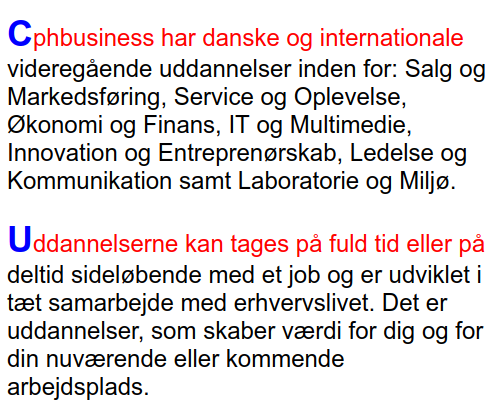

# Opgaver i HTML & CSS

## Opgave 1
Opret en simpel HTML side

[Opgave 1 - Link til PDF](./Opgave_1.pdf)

## Opgave 2
Opret denne HTML side

[Opgave 2 - Link til PDF](./Opgave_2.pdf)

## Opgave 3
Opgave med brug af HTML og en ekstern CSS fil

[Opgave 3 - Link til PDF](./Opgave_3.pdf)

### Løsning
- [HTML dokument](./opgave_3.html)
- [CSS dokument](./opg3_css.css)

## Opgave 4
Første linje i hvert afsnit skal formateres.

[Opgave 4 - Link til PDF](./Opgave_4.pdf)

### Løsning
- [HTML dokument](./opgave_4.html)
- [CSS dokument](./opg4_css.css)

## Opgave 5: Webside (Bootstrap)
Eksempel på en "hel" webside

- [Html filen](./web2.html)
- [CSS filen](./web2.css)