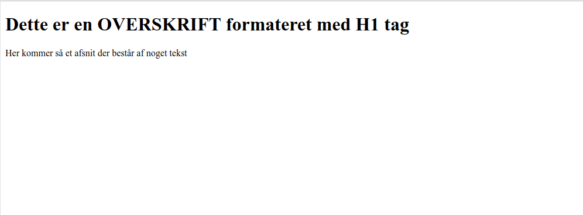
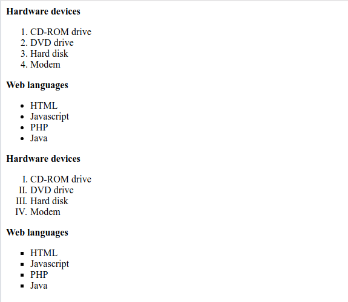

# Opgaver i HTML & CSS

## Opgave 1
Opret en simpel HTML side

[Opgave 1 - Link til PDF](./Opgave_1.pdf)

### Løsning
- [HTML dokument](./opgave_1.html)

## Opgave 2
Opret denne HTML side

[Opgave 2 - Link til PDF](./Opgave_2.pdf)

### Løsning
- [HTML dokument](./opgave_2.html)

## Opgave 3
Opgave med brug af HTML og en ekstern CSS fil

[Opgave 3 - Link til PDF](./Opgave_3.pdf)

### Løsning
- [HTML dokument](./opgave_3.html)
- [CSS dokument](./opg3_css.css)

## Opgave 4
Indtil nu har du bare set dine HTML filer på din lokale computer, nu skal vi have dem over på Digital Ocean serveren - Så alle i hele verden kan se dem :-)

Følg vejledningen her [Tomcat](https://datsoftlyngby.github.io/dat2sem2019Fall/uge35/tomcat.html) og læg HTML og CSS filen fra Opgave 3 op på din Digital Ocean server.

**Husk** at omdøbe HTML filen til *index.html*

## Opgave 5
Første linje i hvert afsnit skal formateres.

[Opgave 5 - Link til PDF](./Opgave_5.pdf)

### Løsning
- [HTML dokument](./opgave_5.html)
- [CSS dokument](./opg5_css.css)

## Opgave JavaScript
Light

- [pic_bulboff.gif](./pic_bulboff.gif)
- [pic_bulbon.gif](./pic_bulbon.gif)

## Opgave Webside
Eksempel på en "hel" webside

- [Html filen](./web2.html)
- [CSS filen](./web2.css)

## Opgave menu
Eksempel på menu struktur

- [HTML filen](./menu.html)
- [CSS filen](./menu.css)
- [HTML underside](./company.html)

## Mandags opgaven
Mandag, hvor vi har feedback på HTML/CSS ugen skal i have lavet nedestående opgave:

[Opgave til mandag](./mandags_opgave.pdf)

I må meget gerne løse den i grupper.

Fremlæggelsen af denne opgave bliver samlet.
En fra hver gruppe fremlægger/viser deres løsning for de andre i klassen.

Ideen med denne fremlæggelse er også at i kan lærer noget af at se de andre grupperes løsninger.
Jeg forventer at i brugere mellem 10 og 15 minutter på fremlæggelsen.

**Punkter:**

* Vis løsningen
* Gennemgå koden for løsningen - Fokus på "noget" smart
* Argumenter for denne løsning

Det betyder at alle skal komme mandag den 02-09-2019 mellem kl. 08:30 og 12:00
