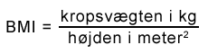

# BMI beregning

[BMI](https://netdoktor.dk/interactive/interactivetests/bmi.php) anvendes inden for sundhedssektoren til at give et fingerpeg om en persons vægtklasse.

## Formel for beregning

Man regner sit BMI ud ved at dividere kropsvægten i kg med kvadratet på højden i meter.

## Krav til løsning

Der skal indtastes flg. i en HTML form:

- Vægt
- Højde

Når man trykker på en beregningsknap, skal parametrene sendes til en servlet, som kalder en BMI beregner (almindelig Java klasse) og forwarder til en jsp side, som viser BMI-tallet på skærmen sammen med flg. information:

| BMI | Kategori |
| ----------------- | ------------ | 
| Under 18,5 |  Undervægtig |
| 18,5-25 | Normalvægtig |
| 25-30 | Overvægtig |
| Over 30 | Svært overvægtig |

1. Lav en hurtig mockup i Adobe XD, som viser hvordan websiderne skal se ud. Tænk gerne på at anvende Bootstrap design. Der skal være en fælles header og footer på alle siderne
2. Lav html og css, som præcis ligner din mockup. 
3. Start et nyt webprojekt op med vores [Command-Pattern skabelon](https://github.com/raakostOnCph/Projektskabelon)
4. Overfør dit html og css design til jsp
5. Lav header og footer om til include-filer.

## Test

Brug beregneren for [BMI](https://netdoktor.dk/interactive/interactivetests/bmi.php) hos Netdoktor til at regne efter. Find højde/vægt så alle kategorier afprøves.

Hvis du får tid, så lav unit-tests, som gør det samme.

## Udvidelser

1. Hver gang en bruger trykker "Beregn" skal du gemme højde og vægt og tidspunktet beregningen blev udført på.
2. Lav en side, hvor du kan se alle de udførste beregninger i en liste.
