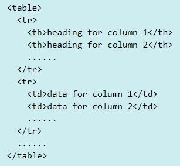

# Boghandel
I skal lave en webshop, hvor man kan "købe" bøger. <br>

## Database
Databasen skal indeholde en bog tabel med disse kolonner: id (primærnøgle), title, author, price, qty (antal på lager). <br>
Indsæt et passende antal bøger i tabellen.

## Web app 
### Servlet
Der skal være en servlet med navn ```FrontController```, der styrer applikationsflow. Dens GET/POST metode skal via hidden field 
på html form få information om den funktion som skal udføres. Servletten kalder funktionen (typisk kalde metode på almindelig Java klasse), og dernæst forwarde til relevant jsp side.

### Landing page
Der skal være en velkomstside ```index.html```, hvor man trykke på knap for at komme til søgeside. Den kan evt. styles lidt "lækkert" :-)

### jsp
Der skal være en 
- søgeside, hvor man kan søge på en bogtitel, eller del af bogtitel. <br>
- søgeresultatside, der viser søgeresultat og hvor man kan vælge bøger i listen (kan gøres med brug af checkbox - se [webshop demo kode](webshop.zip) for inspiration).
- ordreside, hvor valgte bøger vises, subtotal og totalpris.
<p><b>Ekstra feature:</b> Der kan evt. suppleret med mulighed for at angive antal eksemplarer, man ønsker at købe på søgeresultatsiden. <br> 
 </p>


Strukturen for en HTML tabel ser således ud:

 

- table tag repræsenterer en tabel. <br> 
- tr tag repræsenter en række.<br> 
- td tag repræsenter en data celle. <br>
- th tag repræsenter en header celle <br>

<b>Ekstra features:</b>
Man skal kunne angive navn, email og telefonnummer - vi udelader selve betalingsdelen :-) <br>
Husk at tæl antallet af eksemplarer ned i bog tabellen (qty kolonnen) for de respektiver bøger, som "købes".
Gem ordre i databasen, dvs, der skal laves flere tabeller til at håndtere kunde- og ordreinformation. 

### Indkøbskurv (ekstra)
Husk at HTTP er en tilstandsløs protokol. dvs. en web app "husker" ikke tilstandsinformation på tværs af requests. Hvis en bruger vælger at købe flere bøger via flere requests, skal de tidligere valgte bøger "huskes" i en indkøbskurv. Bruge session objekt til dette.

## Test
I skal teste relevante klasser i JUnit.


