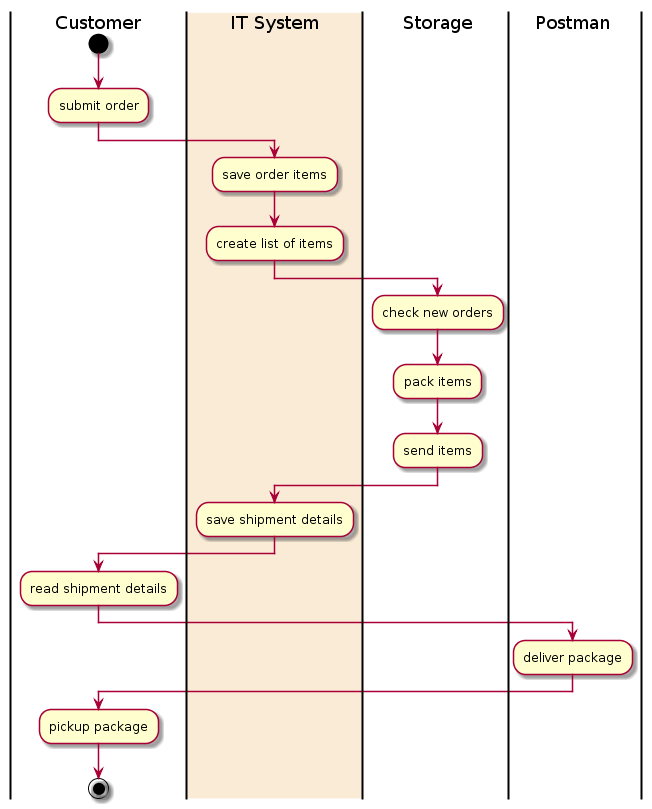
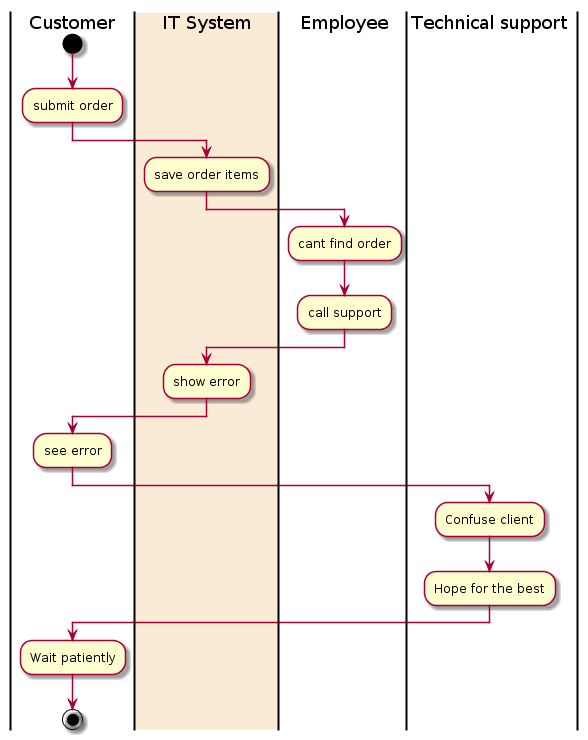

# Aktivitetsdiagrammer


### Resourcer:  

| Emne                                     | Ressourcer                               |
| ---------------------------------------- | ---------------------------------------- |
| Dynamisk: Aktivitets diagram (as-is)     |[Activity diagram med PlantUML](http://plantuml.com/activity-diagram-beta)|
| Powerpoint om aktivitetsdiagrammer       |[Slides](SWD_Lektion8_ActivityDiagrams.pdf)


### Eksempel
```uml
@startuml
|Customer|
start
:call and order items;
|#AntiqueWhite|Employee|
:write down order;
:collect order items;
:pack items;
:send items;
:mail shipment details;
|Customer|
:read shipment details;
|Postman|
:deliver package;
|Customer|
:pickup package;
stop 
@enduml
```  
### AS-IS Diagram: 
This diagram shows the workflow of jobs and responsibilities throughout the process from start to end as it is done by the company, before an IT-system is implemented.

### TO-BE Diagram:
This diagram shows the workflow of jobs and responsibilities as they would be after implementing an IT solution to the problem faced by the company.

### WAS-DONE Diagram:
The was-done diagram is made after termination of the development fase and is done for the purpose of documenting the system, that is delivered to the customer. Hopefully it matches the customers expectations to some degree:


Ved at bruge swimlanes i aktivitetsdiagrammet kan vi visualisere en række usecases hvor en bestemt aktør gør en bestemt handling, som måske kan automatiseres og derved bidrage positivt til virksomhedens arbejdsgange.
I to-be diagrammet kan man se hvordan de enkelte aktører vil komme til at interagere med it-systemet og dette visuelle udtryk kan bruges til at tale med virksomheden om hvorvidt det også er sådan de ser problematikken og en eventuel løsning.
