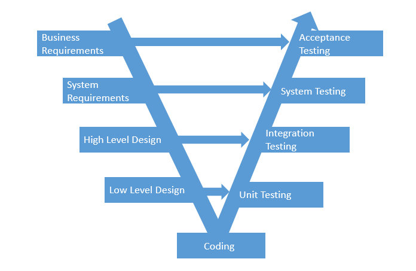
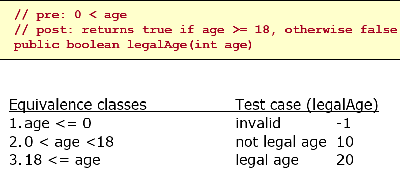
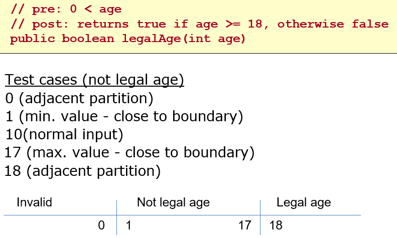
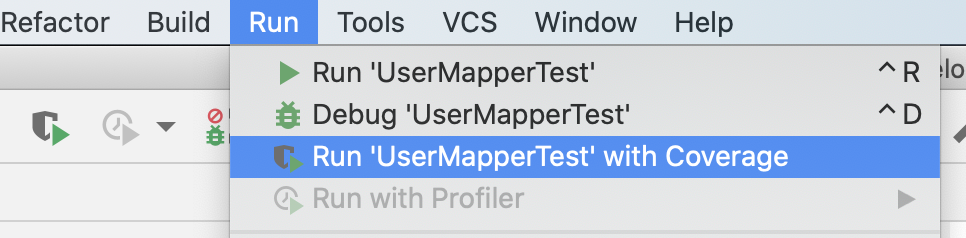
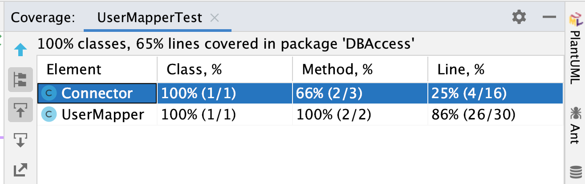

# Test og kvalitet

Hvordan sikrer I jer, at jeres kode virker?

Formålet med undervisningen er at give en mere systematisk tilgang til test og sikring af kvalitet i sin kode.

I et projekt er det vigtigt at sikre sig, at vi:

1. Bygger det rigtige. Dvs, at systemet hjælper med at løse kundens problemer.
2. Bygger det rigtigt. Dvs, at systemet er bygget ordentligt.

Begge dele siger noget om kvaliteten af vores løsning, og der findes mange praksisser, der kan hjælpe os på vej i form af tests. I det følgende skal vi ses på lidt teori om emnet *Test og kvalitet* og samtidig arbejde med nogle konkrete anvisninger på hvordan vi kan sikre en vis kvalitet i semesterprojektet.

Tests laves løbende gennem et projekt på flere niveauer:

   

Figuren illustrerer [V-modellen](https://en.wikipedia.org/wiki/V-Model_(software_development)). V-modellen forsøger at hindre, at fejl og mangler først findes sent i udviklingsprocessen. Idéen er at der er fokus på test lige fra projektstart. At man *samtidig* med at definere forretningskrav som user stories, designer accept tests til disse user stories. At man *samtidig* med at udarbejde high-level design (arkitektur), udarbejder integrationstests mellem lag/subsystemer. Dette princip gælder for alle test niveauer: at tests forberedes så tidligt som muligt, men kan selvfølgelig først afvikles, når koden er skrevet. At skrive tests tidligt er en del af et projekts *løbende* kvalitetssikring. Hvis man har svært ved at designe en test, kan det være udtryk for uklarheder i en specifikation. Det sig være i user stories, en API kontrakt eller på metodesignatur niveau. 

## Testniveauer
### Unit tests
Der laves unit tests for alle "udregninger" i systemet. En unit defineres typisk som en metode, men kan også være en klasse eller en komponent. Disse tests kan enten laves som [black-box](http://softwaretestingfundamentals.com/black-box-testing/) eller [white-box](http://softwaretestingfundamentals.com/white-box-testing/), og der laves både positive og negative tests (dette gælder for alle testniveauer, se mere nedenfor). Unit tests skrives og afvikles umiddelbart efter koden er skrevet for at få kortest mulig feedback (mens koden er i frisk erindring). Med mindre man laver Test-Driven Development, hvor testen skrives først. 
   
Hver enkelt unit test består af tre faser.
> #### Arrange:
> Her gøres klar til at kalde den metode der ønskes testet. Dvs. der oprettes objekter og afhængigheder.
> #### Act
> Metoden kaldes og vi får udregnet det faktiske resultat.
> #### Assert
> Nu bekræftes (eller afkræftes), at det forventede resultat og det faktiske resultat stemmer overens.

### Integration tests
Integrations tests undersøger om forskellige komponenter kan arbejde sammen (f.eks. interfaces mellem lag/subsystemer, filsystem eller database). Disse tests laves typisk som black-box.

### System tests
System test er end-to-end tests af adfærd for en given user story, som tester om alle komponenter virker i en helhed. Optimalt set vil vi gerne automatisere systemtests. [Selenium](https://www.selenium.dev/) er et værktøj til at automatisere på dette niveau, men er ikke pensum på 2. semester.

### Acceptance test
Her involveres kunden i opgaven og vi beder dem om at udføre acceptance tests. Det er bogstavelig talt kundens accept af systemet. Ideelt set vil de andre tests være automatiseret, men denne er typisk ikke. Accepttest kan derfor ses som en delmængde af systemtests, men udført manuelt og på kundens egen platform fremfor i udviklingsmiljø.  
De defineres tidligt i processen (på baggrund af kravene), men afvikles først til allersidst, jf V-modellen ovenfor.

## Typer af tests
### Automatiseret - Manuel
Vi kan bedst lide automatiserede tests. De tager lidt længere tid at konstruere, men det er nemt, hurtigt og billigt at køre dem igen og igen. Efter hver ændring i koden, kører vi alle tests for at bekræfte at de nye ændringer ikke har ødelagt noget. Dette kaldes regressionstesting.
Nogle test kan dog være vanskelige at automatisere - f.eks. brugergrænseflade tests. Der findes værktøjer, som f.eks. [Selenium](https://www.selenium.dev/), som kan automatisere en brugergrænsefladetest, men kompleksiteten stiger som følge heraf.
Selv manuelle tests skal formaliseres ellers tæller de ikke med, så [skriv det ned](https://www.youtube.com/watch?v=BSUMBBFjxrY)

### Positiv - Negativ
Positive test undersøger om systemet kan give de korrekte resultater i normalsituationer (happy path). Negative test bruges til at bekræfte, at systemet fejler som forventet, når vi (med vilje) giver det nogle uhensigtsmæssige input. Det kunne f.eks. være at vi forsøger at bruge null eller den tomme streng som brugernavn, eller prøver at tage kvadratroden af -4.

### Funktionelle - Non-funktionelle
Test af user stories som f.eks *Opret kunde* eller *Beregn lagerstatus* kaldes funktionelle tests.  Test af et systems kvalitet, f.eks. brugervenlighed, svartider (performance), skalerbarhed eller robusthed kaldes ikke-funktionelle tests. 

## Testdesign teknikker
### Black-box - White-box
Overordnet set er forskellen at med en black-box test er vi kun interesseret i resultatet, hvorimod med white-box test teknikken inspicerer vi kodestruktur for at identificere tests cases. En if-sætning vil udløse en test for postiv udfald af if-sætning og en test for falsk udfald. White-box teknikken sikrer således at vi får testet  alle veje gennem systemet og har en meget høj ["code coverage"](https://en.wikipedia.org/wiki/Code_coverage).

### Ækvivalensklassepartionering (black-box teknik)
Ækvivalensklassepartionering er en teknik, som kan anvendes på alle testniveauer. Teknikken inddeler data i partioner, der giver samme programadfærd. Der udledes en test (kaldes mere formelt for en testcase) for hver ækvivalensklasse. Dermed systematiseres identifikationen af test cases og antal test cases reduceres.

Eksempel - metoden legalAge (er du myndig):
 

### Grænseværdianalyse (black-box teknik)
Grænseværdianalyse identificerer test cases i grænserne for et datasæt. Teknikken anvendes typisk i kombination med ækvivalensklassepartionering. Hvis der er en ækvivalensklasse for hhv "lille" (1-20) og "stor" (21-100), vil ækvivalensklassepartionering resultere i to test cases, hvor en værdi i midten af hver ækvivalensklasse vælges, f.eks. 10 og 50.
Grænseværdianalyseteknikken vil tilføjes yderligere 6 test cases for grænseværdierne omkring ækvivalensklasserne: 0, 1, 20, 21, 100, 101.

Eksempel - metoden legalAge (er du myndig):

### Code Coverage (white-box teknik)
Vi vil gerne undersøge hvor stor en del af koden som er dækket af tests. Resultatet kan enten være et samlet procenttal, eller vi kan gå i detaljer og undersøge hvilke kodelinier, som er testet. Sidstnævne kræver et værktøj (eller virkelig meget tålmodighed!).
I IntelliJ er Code Coverage indbygget og køres ved at vælge "Run with Coverage". 

Resultat kan ses i plugin fanebladet "Coverage" længst til højre i IntelliJ vinduet:

## Agil test

### Agile testkvadranter
I agile projekter benytter man gerne de agile testkvadranter til at gruppere de forskellige typer og niveauer af tests. Der er ingen bestemt rækkefølge mellem kvadranterne, men man begynder typisk i Q2.

* Q1 og Q2 relaterer til intern kvalitet - *bygger vi systemet rigtigt*
* Q3 og Q4 har eksternt kundeperspektiv - *bygger vi det rigtige system*

Se f.eks. denne side på [Tutorialspoint](https://www.tutorialspoint.com/agile_testing/agile_testing_quadrants.htm) som uddyber de enkelte elementer i modellen.

## Fog Carport projektet

Her er en række spørgmål, som I gerne skulle kunne besvare, når man vækker jer kl. 3.45 om natten og afkræver et hurtigt svar:

Hvad kunne være værd at teste på carport projektet?

1. Virker vores beregner?
    1. Passer antallet af stolper?
    2. Passer antallet af spær?
    3. osv
    

2. SVG-motor?
    1. Kan jeg tegne et rektangel med en vis størrelse? Virker vores metode?
    2. Kan jeg tegne en pil som f.eks. er 300px lang?

3. Datamappere?
    1. Er der overhovedet hul igennem til databasen?
    2. Kan jeg indsætte en ny bruger?
    3. Kan jeg hente et produkt / liste af produkter?
    4. Bliver en ordres status gemt i databasen når man opdaterer den på jsp siden?

4. Hvad med vores brugergrænseflade?
	1. Kan en kunde finde ud af at bestille en carport? Hvordan afgør vi det?
   2. Kan de ansatte hos Fog finde ud af at bruge systemet?

5. Er vores kode skrevet, så vi automatisk kan teste den?
6. Hvordan sikrer vi os en ensartet kodekvalitet?
7. Hvordan sikrer vi os at vi ikke tjekker fejlagtig kode ind på vores master- eller developerbranch i GitHub?

Prøv i jeres grupper at afgøre hvilken slags test og en lille strategi for hvordan hver test skal gennemføres. I må også meget gerne nævne flere ting I bør teste.

Her er et [Worddokument](FogCarportTestSuite.docx) I kan downloade og udfylde.

### Unit test og integrationstest i Kaspers skabelon

Kaspers Command Pattern Skabelon er allerede forberedt på unit- og integrationstest. Den mest luskede af dem, er helt klart integrationstesten. Dvs, test af vores datamapper metoder. Der er  adskillige ting, som kan gå galt i den proces. Overordnet skal følgende sættes op:

1. Der skal laves en tom test-database og laves en sql-bruger som har adgang. Gør det gerne på localhost.
2. Der skal oprettes en kopi (uden indhold) af tabellerne (og evt. views) fra den rigtige database.
3. Der skal skrives en jdbc connection string, som skal pege på test-databasen.
4. Der skal fyldes test-data i test-databasens tabeller. Det skal gøres hver gang en test køres, så vi er 100% sikre på indholdet. Det gøres i 

Her er en [detaljeret opskrift](IntegrationstestDatabase.md).

## Ressourcer

* [Note om integrationstest med database](IntegrationstestDatabase.md). Den tager udgangspunkt til Kaspers Command Pattern Skabelon.
* Her er en god artikel om at skrive test-bar kode af [Sergey Kolodyi](https://www.toptal.com/qa/how-to-write-testable-code-and-why-it-matters)
* Læs hvad David Bernstein skriver om kodekvalitet [Let Code Quality Guide You](cleancode.md)
* Lisa Crispin om de fire [agile testkvadranter](https://lisacrispin.com/2011/11/08/using-the-agile-testing-quadrants/) og en imponerende [præsentation](https://lisacrispin.com/downloads/CoverBasesWithQuadrants.pdf) med mange gode detaljer

